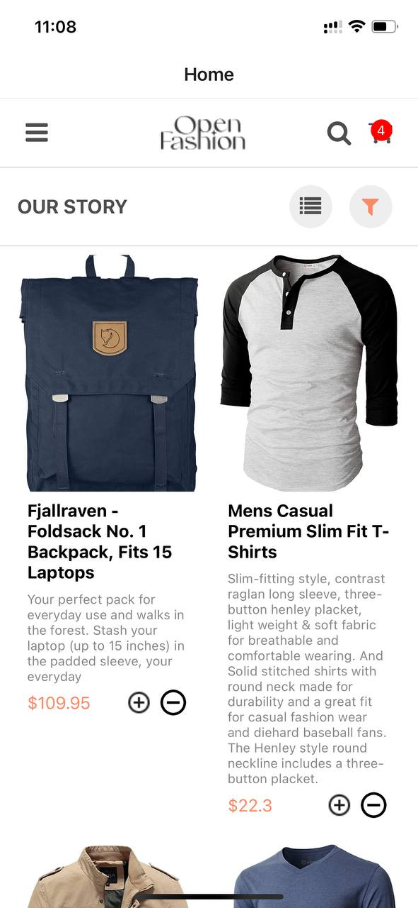
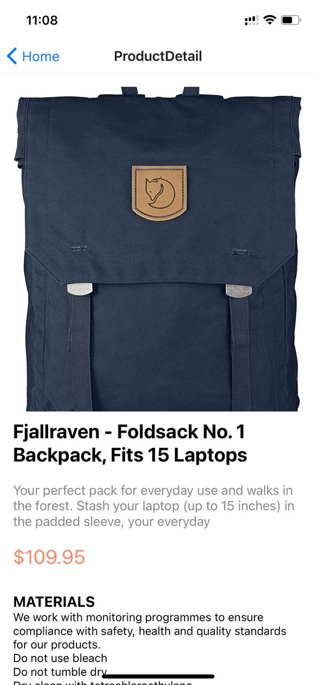
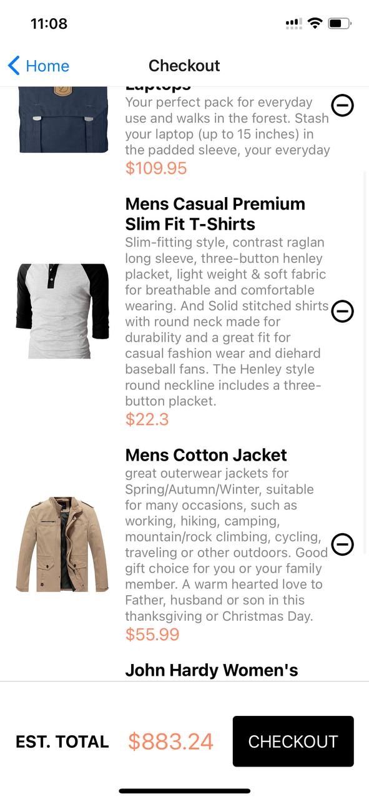
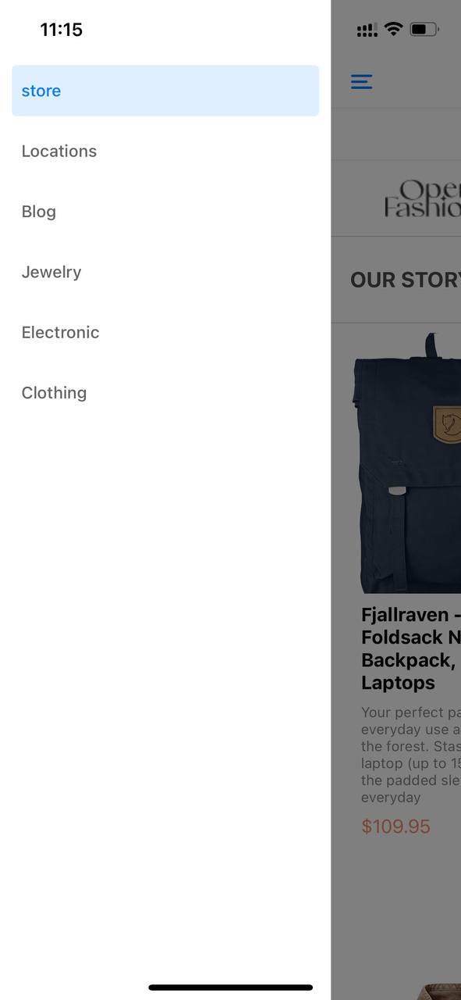

# rn-assignment7-11297233

## Fashion Store App
This is a React Native application for an online fashion store. Users can browse available items, add them to the cart, and proceed to checkout. The app features a drawer navigation for easy access to different sections of the store.

## Features
Home Screen: Displays a list of available fashion items fetched from an external API.
Cart Functionality: Users can add and remove items from the cart. The cart updates dynamically and shows the total number of items.
Checkout Screen: Allows users to view items in their cart and remove them if needed.
Drawer Navigation: A drawer menu that slides out from the left, listing different sections of the store.
Design Choices
Home Screen
Header: Includes a logo, search icon, and a cart icon. The cart icon shows the number of items currently in the cart.
Our Story Row: Contains a brief introduction to the store with filter and category icons for additional functionality.
Item List: Displays items in a grid layout with images, titles, descriptions, and prices. Each item has add and remove buttons to manage the cart.
Drawer Navigation
The drawer navigation provides easy access to different sections of the store, such as the home screen and a list of available dresses. This improves user experience by allowing quick navigation between screens.

## Data Storage
Data storage is managed using a context (CartContext) which holds the state of the cart. This context is used to share the cart state across different components without the need for prop drilling. The cart items are stored in the context, and the functions addToCart and removeFromCart are used to update the cart.

## External API
The list of available items is fetched from the https://fakestoreapi.com/products API. This approach ensures that the app has the most up-to-date information on available products without the need for hardcoding data.

